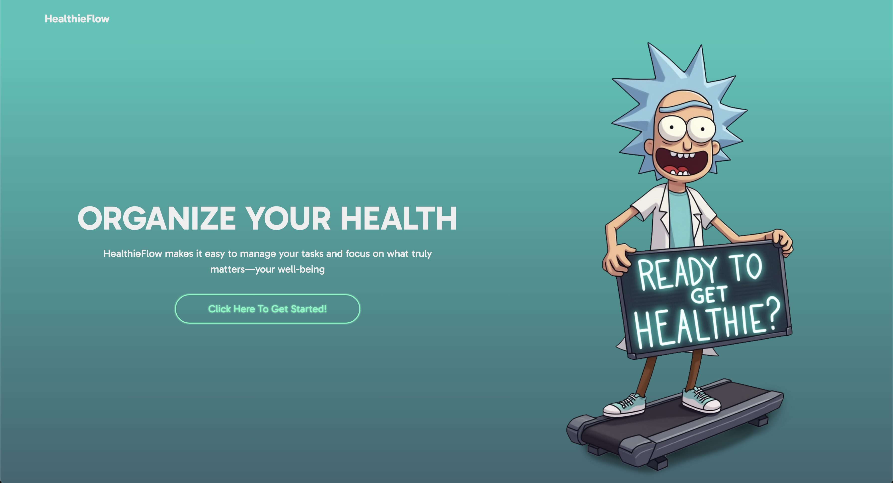
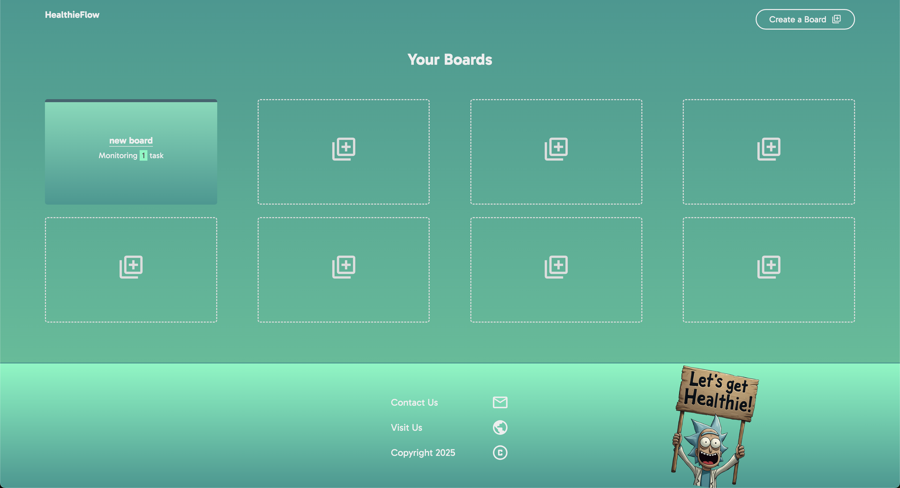
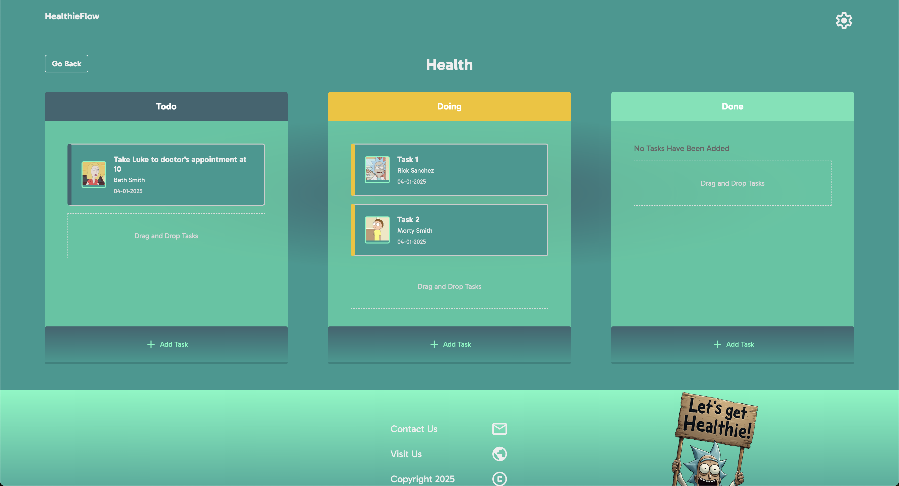
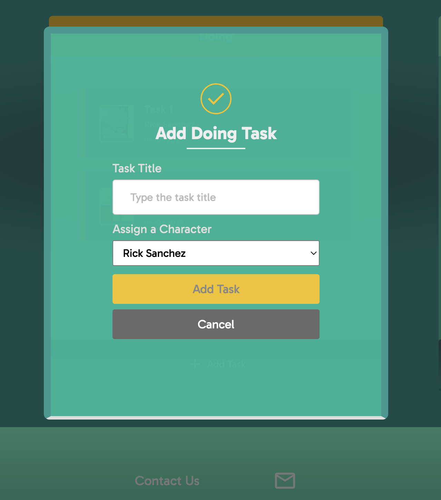

# HealthieFlow

HealthieFlow is a task management application designed to help users organize their tasks, track progress, and focus on their well-being. Built with **React**, **TypeScript**, and **Vite**, HealthieFlow provides a modern, responsive, and user-friendly interface for managing tasks efficiently.

---

## Features

- **Drag-and-Drop Task Management**: Easily move tasks between columns or reorder them within a column using drag-and-drop functionality powered by `@dnd-kit`.
- **Responsive Design**: Fully responsive layout that works seamlessly across devices.
- **Task Modal**: Add, edit, and view task details in a modal interface.
- **State Management**: Centralized state management using a custom store.
- **GraphQL Integration**: Fetch and manage data using Apollo Client and GraphQL.
- **Local Storage**: Offline support using `idb` for IndexedDB.
- **Custom Styling**: Beautiful UI with custom CSS and animations.


---

## Getting Started

### Prerequisites

Ensure you have the following installed:

- **Node.js**
- **pnpm (Optional)**

### Installation

1. Clone the repository:

   ```bash 
   git clone https://github.com/your-username/healthieflow.git
   cd healthieflow

2. Install dependencies:
   ```pnpm install```

3. Start the development server:
```pnpm dev```

4. Open your browser and navigate to ```http://localhost:5173```


### Scripts
The following scripts are available in the package.json:

- pnpm dev: Starts the development server.
- pnpm build: Builds the project for production.
- pnpm preview: Previews the production build.
- pnpm lint: Runs ESLint to check for code quality issues.

### Technologies Used

- React: A JavaScript library for building user interfaces.
- TypeScript: A strongly typed programming language that builds on JavaScript.
- Vite: A fast build tool for modern web projects.
- React Router: For client-side routing.
- @dnd-kit: For drag-and-drop functionality.
- Apollo Client: For GraphQL data fetching and state management.
- GraphQL: For querying and mutating data.
- IndexedDB: Offline storage using the idb library.

### Styling

CSS: Custom styles for components and layouts.
Responsive Design: Media queries for mobile and desktop views.

## Features in Detail

### Drag-and-Drop Task Management
HealthieFlow uses @dnd-kit to provide a seamless drag-and-drop experience. Users can:

- Reorder tasks within a column.
- Move tasks between columns.
- Drag tasks into empty columns.

### State Management
The application uses a custom store for managing global state, ensuring a consistent and predictable state across components.

### Responsive Design
The layout adapts to different screen sizes, providing an optimal experience on both desktop and mobile devices.

### Deployment
HealthieFlow is configured for deployment on Netlify. To deploy:

1. Build the project:
```pnpm build```

2. Deploy the dist/ folder to Netlify.
```bash
netlify deploy
```

### License
This project is licensed under the MIT License. See the [https://github.com/twbs/bootstrap/blob/main/LICENSE](LICENSE) file for details.

### Acknowledgments
- React: For providing a robust framework for building user interfaces.
- Vite: For blazing-fast development and build tools.
- @dnd-kit: For the drag-and-drop functionality.
- Day.js: For date manipulation.
- Netlify: For easy deployment.

### Screenshots

#### Landing Page


#### Boards Dashboard


#### Single Board


#### Task Form


